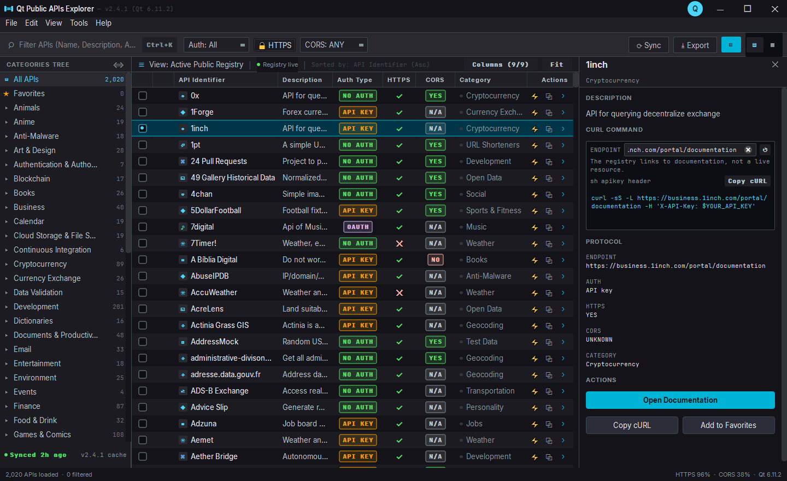
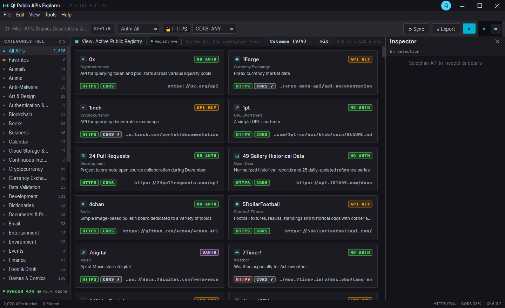

# Qt Public APIs Explorer

A native Qt6 desktop browser for the community-curated
[public-apis/public-apis](https://github.com/public-apis/public-apis) registry —
2,000+ APIs across 51 categories, searchable and filterable offline.




## Running

```bash
pip install -r requirements.txt
python main.py
```

The app ships with a bundled snapshot in `data/catalog.json`, so it works
offline on first launch. Use **Sync** (or `Ctrl+R`) to pull the latest README
from GitHub.

## Features

| Pane | What it does |
| --- | --- |
| **Title bar** | App identity, version + Qt runtime, window controls |
| **Menu bar** | File / Edit / View / Tools / Help, with accelerators |
| **Toolbar** | Search, auth + CORS filters, HTTPS toggle, Sync, Export, view switcher |
| **Category tree** | All APIs, Favorites, and every category with live counts |
| **Data grid** | 9-column high-density table, sortable, alternating rows, status chips |
| **Card grid** | The same records as a paged two-column card flow (`Ctrl+Shift+V`) |
| **Inspector** | Description, generated cURL, protocol facts, open/copy/favorite |
| **Status bar** | Filtered/total counts plus HTTPS %, CORS %, Qt runtime |

### Two views

The segmented control in the toolbar (also `Ctrl+Shift+V`) switches between the
table and a card grid. The card layout is derived from the design tokens —
`surface-container-low` fill, 16px padding, 4px radius, 2px badges — because
the mock ships no card artwork.

The card view holds the whole filtered result set and materialises **240 cards
at a time** behind a numbered pager, so all 2,000+ records stay reachable
without building a widget per record. A pinned strip carries numbered page
tabs, `‹`/`›` arrows and a `Page X of Y` readout; it collapses when the result
set fits on a single page.

### Filtering

Search matches name, description, category and URL; multiple words are ANDed.
The auth, HTTPS and CORS controls combine with search and category selection.

### cURL generation with an editable endpoint

The registry links to **documentation pages, not live endpoints**, so the
generated command targets the docs URL by default and the inspector says so.
Paste a real endpoint into the `ENDPOINT` field and the command regenerates
immediately; `↺` restores the registry link. Auth headers are injected where the
registry declares a scheme (`apiKey` → `X-API-Key`, `OAuth` →
`Authorization: Bearer`, plus `x-mashape-key` and `user-agent`).

Endpoints that are non-HTTPS — either because the registry says so or because
the URL you entered is `http://` — get `--insecure` and a warning comment.

### Export

Exports the **currently visible** rows, so it respects every active filter.
CSV and JSON are supported.

### Sync runs in the background

Refresh happens on a `QThread` worker (`qtapis/sync.py`) inside the *same*
process — the UI stays interactive and search keeps working mid-sync. The app
never spawns a subprocess or a shell.

### One title bar

The window is frameless, so the themed bar in `design.md` is the only chrome —
no second native title bar stacked above it. Because that drops the OS
affordances, the bar provides them: drag to move, double-click to maximize,
working minimize/maximize/close, and edge resizing with matching cursors.

## Keyboard shortcuts

| Shortcut | Action |
| --- | --- |
| `Ctrl+K` | Focus search |
| `Ctrl+R` | Sync from GitHub |
| `Ctrl+Shift+R` | Reset all filters |
| `Ctrl+Shift+V` | Toggle card view |
| `Ctrl+E` | Export visible rows |
| `Ctrl+D` | Toggle favorite on the selected row |
| `Ctrl+Shift+C` | Copy the selected row's cURL |
| `Ctrl+Return` | Open the selected documentation |
| `Ctrl+B` / `Ctrl+I` | Toggle the category drawer / inspector |
| `Ctrl+Q` | Quit |

## Layout

```
main.py                 entry point (bundled fonts, theme, main window, --selftest)
qtapis/
  theme.py              design tokens, spacing scale, global Qt stylesheet
  fonts.py              registers the bundled Inter + JetBrains Mono faces
  paths.py              resource paths that work from source and when frozen
  catalog.py            ApiRecord model and the README markdown parser
  store.py              snapshot load/save and the GitHub fetch
  sync.py               QThread worker + controller for background refresh
  models.py             table model and the filtering/sorting proxy
  delegates.py          status-chip and inline-action painting
  cards.py              card/grid view (token-derived layout)
  widgets.py            title bar, search well, category tree, status bar
  inspector.py          right-docked detail pane and cURL well
  curlgen.py            cURL command generation from an overridable endpoint
  mainwindow.py         three-pane workstation and all interaction wiring
assets/fonts/           Inter + JetBrains Mono TTFs (SIL OFL, licenses included)
assets/app.ico          multi-resolution app icon
data/catalog.json       bundled offline snapshot (also holds favorites)
QtPublicApis.spec       PyInstaller build definition
tools/build_snapshot.py regenerate the snapshot from upstream
tools/make_icon.py      regenerate assets/app.ico (pure Python, no Qt)
tools/screenshot.py     render the window to a PNG without showing it
tests/test_app.py       92 end-to-end GUI checks
```

## Development

```bash
# regenerate the bundled snapshot from upstream
python tools/build_snapshot.py

# run the test suite (headless; no window, no network, no browser)
python tests/test_app.py

# opt into a real GitHub fetch for the sync tests
python tests/test_app.py --live

# verify a build (works frozen too)
python main.py --selftest report.json

# render screenshots
python tools/screenshot.py out.png table
python tools/screenshot.py out.png cards
```

## Packaging to Windows

See **[BUILD.md](BUILD.md)**. Short version:

```bash
pip install pyinstaller
python tools/make_icon.py
python -m PyInstaller QtPublicApis.spec --noconfirm
```

Produces `dist/QtPublicAPIs/QtPublicAPIs.exe` — windowed, no console.

### Testing notes

The suite runs under `QT_QPA_PLATFORM=offscreen`, so it never creates a window
and is safe on a tiling window manager. Two guards are deliberate:

- `QDesktopServices.openUrl` is stubbed, so a test can never launch a browser.
- Sync tests use a fixture README unless you pass `--live`, so the suite does
  not touch the network.

### Screenshots under a tiling WM

`tools/screenshot.py` sets `Qt.WA_DontShowOnScreen`, which makes Qt lay out and
paint into an offscreen surface **without mapping a window**. Nothing is created
for a tiling WM to manage, so captures are deterministic under glazewm, Hyprland
or in CI. It runs on the native plugin so the bundled fonts resolve.

## Fonts

Inter and JetBrains Mono are bundled in `assets/fonts/` and registered at
startup, so the interface matches `design/design.md` on any machine instead of
silently falling back to Segoe UI / Consolas. Both are SIL OFL; the licenses are
included as `OFL-Inter.txt` and `OFL-JetBrainsMono.txt`.

### Contributors

Thanks to everyone who has helped shape this explorer.

- [@Kingmaxx22](https://github.com/Kingmaxx22) — author and maintainer
- [@codebuff](https://github.com/codebuff) — co-author of the implementation

Contributions of any kind are welcome: open an issue or a pull request.

## License

BSD 2-Clause. See [LICENSE](LICENSE).

The bundled Inter and JetBrains Mono fonts are licensed separately under the
SIL Open Font License; see `assets/fonts/OFL-Inter.txt` and
`assets/fonts/OFL-JetBrainsMono.txt`.

## Design

The interface follows `design/design.md`: edge-to-edge docking, 1px hairline
borders, sunken wells, zero drop shadows, and functional accent colors only.
Where the design doc's frontmatter tokens and its prose hex values disagree, the
frontmatter wins — that is the palette the Stitch mock actually renders.
Tokens live in `qtapis/theme.py`.

## Known limitations

- The card view paginates 240 at a time; there is no "jump to record" field.
- `data/catalog.json` doubles as the offline cache and the favorites store, so
  closing the app rewrites it.
- Export covers the visible rows only; there is no "export everything" option.
- The packaged `.exe` is unsigned, so Windows SmartScreen warns on first run.